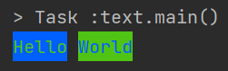
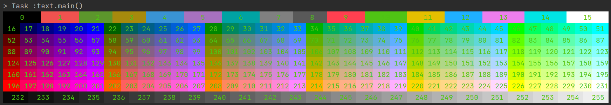
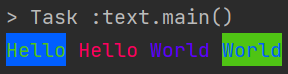

# colorful-printer
## 1. 以普通方式构建字符串 
```java
public class text {
    public static void main(String[] args) {
        new Printer(Color.GREEN, Color.BLUE, "Hello")
                .append(' ')
                .append(Color.BLUE, Color.GREEN, "World")
                .println();
    }
}
```
输出效果： 

## 2. 使用模板来构建字符串  
```java
public class text {
    public static void main(String[] args) {
        //通过 Lambda 自定义颜色模板，根据 index 创建新的背景颜色 Color 对象，而文本颜色恒为绿色
        var printer = new Printer( index ->
                new TextColors(Color.GREEN, new Color(index))
        );
        for (int i = 0; i < 256; i++) {
            if (i < 16) {
                if (i < 2 || 3 < i && i < 7 || 8 < i && i < 11 || 12 < i) {
                    printer.appendByTemplate("    ", i, "    ");
                } else {
                    printer.appendByTemplate("    ", i, "   ");
                }
                if (i == 15) printer.append(TextColors.NextLineStr);
            } else if (i < 88) {
                printer.appendByTemplate(" ", i, " ");
                if (i == 51 || i == 87) printer.append(TextColors.NextLineStr);
            } else if (i < 124) {
                if (i < 100) {
                    printer.appendByTemplate(" ", i, " ");
                } else {
                    printer.appendByTemplate(" ", i);
                }
                if (i == 123) printer.append(TextColors.NextLineStr);
            } else if (i < 232) {
                printer.appendByTemplate(" ", i);
                if (i == 159 || i == 195 || i == 231) printer.append(TextColors.NextLineStr);
            } else {
                printer.appendByTemplate("  ", i, " ");
            }
        }
        printer.println();
    }
}
```
输出效果： 

## 3. 使用 select 函数来修改构建好的字符串 
```java
public class text {
    public static void main(String[] args) {
        var print = new Printer(Color.GREEN, Color.BLUE, "Hello");

        print.append(' ').append(Color.BLUE, Color.GREEN, "World")
                .select(print.ThisOne(), editor -> editor.insert(Color.MAGENTA, "Hello")
                        .insert(' ')
                        .insert(Color.CYAN, "World "))
                .println();
    }
}
```
输出效果： 
## 4. 项目地址
[FLAAC3/colorful-printer](https://github.com/FLAAC3/colorful-printer)
